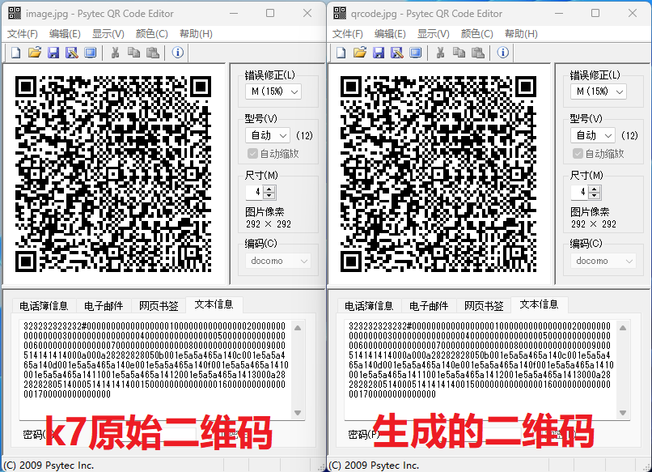

# k7v3wifiSp
解析k7v3 wifi版的光谱分享二维码，根据用户设定的光谱数据表格生成二维码

主要参考：https://www.bilibili.com/video/BV1WW4y1a7rr/  
感谢这位up的分享
## 使用
### 解析k7v3 wifi版的光谱分享二维码，生成csv格式表格  
1. 把k7v3 wifi版app生成的`光谱分享二维码`，命名为`image.jpg`，放在[`qrcode2csv.py`](src/qrcode2csv.py)同路径下  
2. 运行`qrcode2csv.py`  
3. 这样就会在当前路径下生成`spectrum.csv`文件，用excel打开即可查看编辑。
### 根据csv格式的光谱文件，生成二维码
1. 修改上面生成的`spectrum.csv`文件后，放在[`csv2qrcode.py`](src/csv2qrcode.py)同路径下
2. 运行`csv2qrcode.py`  
3. 这样就会在当前路径下生成`qrcode.jpg`文件

## 效果
  

**代码原理可以查看`src/demo`文件夹中的[demo.ipynb](src/demo/demo.ipynb)**
